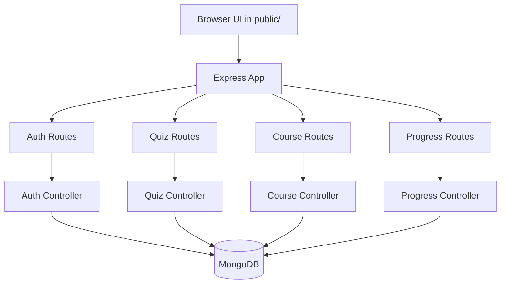

# PathAI - Personalized Learning Path Platform

A full-stack learning platform that personalizes coding paths based on onboarding + assessment performance.

This project combines:
- A Node.js + Express backend
- MongoDB data models for users, courses, topics, quizzes, and progress
- A multi-page frontend (vanilla HTML/CSS/JS)
- JWT-based authentication with optional Google sign-in

---

## Table of Contents

- [Overview](#overview)
- [Working Demo](#working-demo)
- [Core Features](#core-features)
- [How the App Works](#how-the-app-works)
- [Architecture](#architecture)
- [Tech Stack](#tech-stack)
- [Project Structure](#project-structure)
- [API Endpoints](#api-endpoints)
- [Data Models](#data-models)
- [Getting Started](#getting-started)
- [Environment Variables](#environment-variables)
- [Database Seeding](#database-seeding)
- [Production Deployment](#production-deployment)
- [Current Behavior Notes](#current-behavior-notes)
- [Future Improvements](#future-improvements)

---

## Overview

PathAI helps learners move through structured courses and topic quizzes with progression based on actual performance.

---

## Working Demo

- Live Demo: [Add your deployed app URL here](https://your-demo-link-here)

Key flow:
1. User registers/logs in (email/password or Google).
2. User completes onboarding.
3. User takes assessment quiz.
4. System computes level (`beginner`, `intermediate`, `advanced`) and track (`nodejs`, `dsa-cpp`, `other`).
5. System recommends a course.
6. User studies topics and unlocks next topics by passing quizzes.
7. Dashboard displays activity, streak, progress, and transformation analytics.

---

## Core Features

- Authentication
  - Register/login with email + password
  - Google OAuth access-token based sign-in
  - JWT-protected APIs

- Onboarding
  - Captures learner goals, background, preferred track, available time, and challenge areas

- Assessment engine
  - Fetches published assessment quiz
  - Scores submission
  - Derives learner level + preferred track
  - Assigns an initial recommended course

- Learning path experience
  - Fetches recommended course plan
  - Provides topic reader view
  - Topic unlock logic based on quiz completion/pass status

- Dashboard analytics
  - Overall progress
  - Quiz metrics
  - Day streak
  - Activity timeline
  - Difficulty-wise topic mastery
  - Learning path transformation insights

---

## How the App Works

### 1) Server startup
- `server.js` loads env vars, connects DB, creates app, and starts Express.
- `src/app.js` registers middleware and route modules.

### 2) Authentication and identity
- `src/controllers/auth.controller.js` handles register/login/profile/logout/google auth/onboarding save.
- `src/middleware/auth.middleware.js` validates bearer token and injects authenticated user into `req.user`.

### 3) Assessment and recommendation
- `src/controllers/quiz.controller.js` handles:
  - assessment quiz fetch
  - topic quiz fetch
  - submission + score persistence
  - level and track detection for assessment submissions
  - initial course allotment

### 4) Learning path delivery
- `src/controllers/course.controller.js` builds a recommended course plan and topic unlock state.

### 5) Progress analytics
- `src/controllers/progress.controller.js` aggregates progress rows and returns dashboard metrics.

### 6) Frontend pages
- `public/` contains static pages and JS modules for each page.
- Browser scripts use `window.Api`, `window.Auth`, `window.UI`, and page-specific logic files.

---

## Architecture



Request lifecycle (protected routes):
1. Client sends `Authorization: Bearer <token>`
2. `protect` middleware verifies JWT
3. Controller executes business logic
4. Standard JSON response returned via response helpers

---

## Tech Stack

Backend:
- Node.js
- Express 5
- Mongoose
- JWT (`jsonwebtoken`)
- bcrypt/bcryptjs
- CORS + dotenv

Frontend:
- Multi-page HTML
- CSS per page + global styles
- Vanilla JavaScript modules

Database:
- MongoDB

Dev tooling:
- nodemon

---

## Project Structure

```text
.
|- server.js
|- package.json
|- public/
|  |- *.html
|  |- css/
|  `- js/
|     |- pages/
|     `- utils/
`- src/
   |- app.js
   |- config/
   |- controllers/
   |- middleware/
   |- models/
   |- routes/
   |- seeders/
   |- services/
   |- utils/
   `- validators/
```

---

## API Endpoints

Base URL: `/api`

### Auth
- `POST /api/auth/register`
- `POST /api/auth/login`
- `GET /api/auth/google/config`
- `POST /api/auth/google`
- `POST /api/auth/onboarding` (protected)
- `GET /api/auth/me` (protected)
- `POST /api/auth/logout` (protected)

### Quiz
- `GET /api/quiz/assessment` (protected)
- `GET /api/quiz/:quizId` (protected)
- `POST /api/quiz/submit` (protected)

### Course
- `GET /api/course/recommended` (protected)

### Progress
- `GET /api/progress/dashboard` (protected)
- `GET /api/progress/assessment-status` (protected)

JSON response format:

```json
{
  "success": true,
  "message": "...",
  "data": {}
}
```

Errors use:

```json
{
  "success": false,
  "message": "...",
  "errors": null
}
```

---

## Data Models

### User
- Identity: name, email, password
- Auth provider: local/google
- Assessment outputs: `level`, `assessedTrack`, `allottedCourseId`
- Onboarding payload and completion status

### Course
- title, description, level, track
- topic references + `totalTopics`
- publish state, tags, thumbnail

### Topic
- course ownership (`courseId`)
- order + content + duration
- optional resources

### Quiz
- assessment quiz or topic quiz
- embedded questions (4 options each)
- difficulty, track, passing score

### Progress
- user quiz attempts
- score metadata
- assessment-specific track and recommendation snapshots
- used to build dashboard analytics

---

## Getting Started

### Prerequisites
- Node.js 18+ (recommended: latest LTS)
- npm
- MongoDB instance (local or cloud)

### Install

```bash
npm install
```

### Run (development)

```bash
npm run dev
```

### Run (production style)

```bash
npm start
```

Default local URL:
- `http://localhost:3000`

---

## Environment Variables

Create a `.env` file at the project root.

Suggested variables:

```env
NODE_ENV=development
PORT=3000
HOST=0.0.0.0
MONGO_URI=mongodb://localhost:27017/learningpath_db
MONGO_TIMEOUT_MS=10000
JWT_SECRET=your_super_secret_key
JWT_EXPIRES_IN=7d
CORS_ORIGIN=http://localhost:3000
TRUST_PROXY=false
JSON_LIMIT=100kb
GOOGLE_CLIENT_ID=your_google_oauth_client_id
```

Notes:
- `MONGO_URI` is required for DB connection.
- `JWT_SECRET` is required for token generation/verification.
- `CORS_ORIGIN` is required in production and supports comma-separated origins.
- `GOOGLE_CLIENT_ID` is required only for Google auth flow.

---

## Database Seeding

The project includes seed scripts in `src/seeders/`.

Run examples:

```bash
node src/seeders/seed.js
```

```bash
node src/seeders/dsaseed.js
```

```bash
node src/seeders/initdata.js
```

`initdata.js` currently clears users.

---

## Production Deployment

Production readiness changes included:
- CORS allowlist via `CORS_ORIGIN`
- Request payload size limits via `JSON_LIMIT`
- `GET /api/health` health endpoint
- Environment validation at startup
- Graceful shutdown on `SIGINT` / `SIGTERM`
- Safer 5xx error responses in production

Recommended deployment checklist:
1. Set `NODE_ENV=production`.
2. Set strong secrets and do not commit `.env`.
3. Set `CORS_ORIGIN` to your frontend domain(s).
4. Set `TRUST_PROXY=true` if deployed behind a reverse proxy (Render, Railway, Nginx, etc.).
5. Verify `GET /api/health` after deployment.
6. Rotate credentials if any secret was exposed.

---

## Current Behavior Notes

- Static page routes are served from `src/routes/page.routes.js`.
- Some page routes are redirected as temporary fallbacks:
  - `/path` -> `/courses`
  - `/topic` -> `/courses`
  - `/results` -> `/dashboard`
  - `/profile` -> `/dashboard`
- A few files currently exist as placeholders and are empty (for example in some `services/`, `routes/`, and `public/js/` modules).

---

## Future Improvements

- Add automated tests (unit/integration)
- Add API docs (OpenAPI/Swagger)
- Improve role/permission model
- Add rate limiting and stronger security hardening
- Add CI pipeline and lint/format scripts
- Implement remaining placeholder modules and pages

---

## License

No license specified yet in repository metadata.
Add a `LICENSE` file if you plan to distribute this project publicly.
